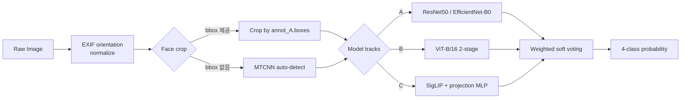
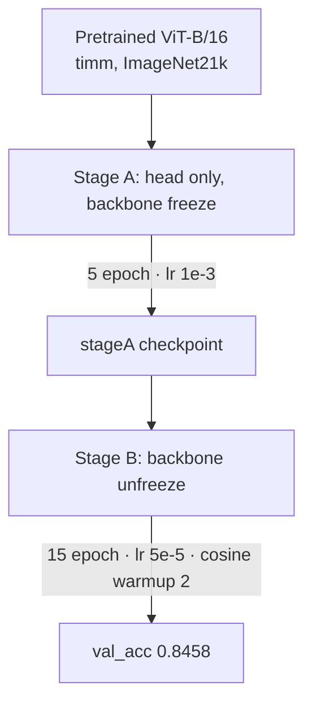
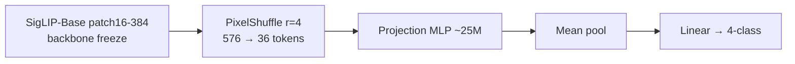

# 표정이야기 — HybridFER-4E

한국인 얼굴 이미지에서 4감정(anger / happy / panic / sadness)을 분류하는 모델. CNN·ViT·SigLIP 세 트랙을 개별 학습 후 soft voting 으로 묶는다.


## TL;DR

- Val acc **0.8600** (ensemble, bbox 상한) / **0.8442** (ensemble + MTCNN auto-crop, bbox-free inference)
- Single-model best **0.8458** (ViT-B/16 2-stage fine-tune)
- 3-rater agreement ceiling 약 0.88. 앙상블이 ceiling 권역까지 도달
- 재현 환경: A40 48GB, conda `user4_env`, seed 42

## Quick Start

```bash
# 0) 환경 복구 (lock 파일 기반, 새 pod 에서)
bash scripts/restore_env.sh user4_env
conda activate user4_env

# 1) 단일 이미지 추론 — 앙상블 + 자동 얼굴 검출 + TTA
python predict.py \
    --model models/ensemble_mtcnn.json \
    --image path/to/face.jpg \
    --tta --tta-crops 5crop --tta-scales 224,256

# 2) 단일 모델만 쓰고 싶을 때 (최고 단일: ViT-B/16)
python predict.py \
    --model models/exp05_vit_b16_two_stage.pt \
    --image path/to/face.jpg
```

CLI 출력 예시:

```
$ python predict.py --model models/ensemble_mtcnn.json --image sample.jpg --tta
[load] ensemble config: models/ensemble_mtcnn.json  (4 sub-models, method=weight_opt_raw)
[load] ResNet50 (h5)          weight=0.042
[load] EfficientNet-B0 (h5)   weight=0.107
[load] ViT-B/16 (pt)          weight=0.382
[load] SigLIP + projection    weight=0.469
[predict] image=sample.jpg  auto_face_crop=True  tta=True
  anger   : 0.0187
  happy   : 0.9231   <-- argmax
  panic   : 0.0348
  sadness : 0.0234
label=happy  confidence=0.9231
```

Python API 는 `(label, confidence)` 튜플 반환 — 예) `("happy", 0.923)`.

### Smoke Test (설치 후 1분 검증)

```bash
# val 폴더에서 임의 이미지 1장으로 loader + predict 정상 동작 확인
python -c "
from predict import load_model, predict, CLASSES
from pathlib import Path
m = load_model('models/ensemble_mtcnn.json')
sample = next(Path('data_rot/img/val').rglob('*.jpg'))
label, conf = predict(m, str(sample))
print(f'OK  {sample.name}  →  {label} ({conf:.3f})')
assert label in CLASSES, 'label 이 CLASSES 밖'
print('smoke test PASS')
"
```

## Python API

```python
from predict import load_model, predict

# 앙상블 config (JSON) 로드. MTCNN 자동 얼굴 검출 + TTA 포함
model = load_model(
    "models/ensemble_mtcnn.json",
    auto_face_crop=True,           # bbox 없는 입력도 자동으로 얼굴만 잘라 추론
    tta=True,
    tta_crops="5crop",             # 5-crop (center + 4 corners)
    tta_scales=[224, 256],         # multi-scale
    tta_hflip=True,                # horizontal flip
)

label, confidence = predict(model, "path/to/face.jpg")
print(f"{label}: {confidence:.3f}")
```

### Jupyter / Colab 노트북 사용

```python
# Cell 1 — 레포 루트를 sys.path 에 추가 (노트북을 임의 위치에서 돌릴 때)
import sys
from pathlib import Path
REPO = Path("/workspace/user4/emotion-project")   # 레포 루트
if str(REPO) not in sys.path:
    sys.path.insert(0, str(REPO))

from predict import load_model, predict, predict_probs, CLASSES
print("classes:", CLASSES)   # ['anger', 'happy', 'panic', 'sadness']
```

```python
# Cell 2 — 모델 1회 로드 (앙상블 config + MTCNN auto-crop + TTA)
model = load_model(
    str(REPO / "models/ensemble_mtcnn.json"),
    device="auto",                 # 'cuda' 가능하면 자동으로 GPU
    auto_face_crop=True,           # 얼굴 자동 검출 (MTCNN)
    face_crop_margin=0.1,
    tta=True,
    tta_crops="5crop",
    tta_scales=[224, 256],
    tta_hflip=True,
)
```

```python
# Cell 3 — 단일 이미지 추론
label, conf = predict(model, str(REPO / "data_rot/img/val/happy/sample.jpg"))
print(f"{label}  (confidence={conf:.4f})")

# 확률 벡터가 필요하면 predict_probs
import numpy as np
probs = predict_probs(model, str(REPO / "data_rot/img/val/happy/sample.jpg"))
for c, p in zip(CLASSES, probs):
    print(f"  {c:8s} {p:.4f}")
```

### 테스트셋 배치 추론

테스트셋이 **클래스별 폴더** 로 되어 있거나 **flat 디렉터리** 인 두 경우 모두 대응.

```python
# Cell 4 — 배치 추론 유틸
import csv
from pathlib import Path

IMG_EXT = {".jpg", ".jpeg", ".png", ".bmp", ".webp"}

def iter_test_images(test_dir):
    """test_dir 하위를 2단계까지 스캔. (img_path, class_name_or_None) 반환.
    - test_dir/<class>/*.jpg    → class_name = 디렉터리명
    - test_dir/*.jpg            → class_name = None (라벨 없음)
    """
    root = Path(test_dir)
    if not root.is_dir():
        raise FileNotFoundError(f"test_dir 없음: {root}")
    # 클래스별 하위폴더가 CLASSES 안에 하나라도 있으면 '라벨 있는 구조' 로 판정
    subdirs = [p for p in root.iterdir() if p.is_dir()]
    has_class_dirs = any(p.name in CLASSES for p in subdirs)
    if has_class_dirs:
        for cls_dir in sorted(subdirs):
            if cls_dir.name not in CLASSES:
                continue
            for ip in sorted(cls_dir.iterdir()):
                if ip.suffix.lower() in IMG_EXT:
                    yield ip, cls_dir.name
    else:
        for ip in sorted(root.iterdir()):
            if ip.is_file() and ip.suffix.lower() in IMG_EXT:
                yield ip, None
```

```python
# Cell 5 — 배치 추론 실행 + CSV 저장
TEST_DIR = REPO / "data_rot/img/val"         # 외부 test set 경로로 바꾸면 됨
OUT_CSV = REPO / "results/test_predictions.csv"
OUT_CSV.parent.mkdir(parents=True, exist_ok=True)

rows = []
errors = 0
for img_path, gt in iter_test_images(TEST_DIR):
    try:
        probs = predict_probs(model, str(img_path))   # shape (4,)
        pred_idx = int(probs.argmax())
        pred_label = CLASSES[pred_idx]
        conf = float(probs[pred_idx])
    except Exception as e:
        errors += 1
        if errors <= 5:
            print(f"[err] {img_path.name}: {e}")
        continue
    rows.append({
        "filename": img_path.name,
        "pred": pred_label,
        "confidence": round(conf, 4),
        "gt": gt if gt is not None else "",
        **{f"p_{c}": round(float(probs[i]), 4) for i, c in enumerate(CLASSES)},
    })

# CSV 쓰기 (utf-8-sig: 엑셀에서 한글 깨짐 방지)
with open(OUT_CSV, "w", newline="", encoding="utf-8-sig") as f:
    w = csv.DictWriter(f, fieldnames=list(rows[0].keys()))
    w.writeheader()
    w.writerows(rows)
print(f"저장: {OUT_CSV}  (n={len(rows)}, errors={errors})")
```

```python
# Cell 6 — 라벨이 있으면 accuracy / per-class F1 / confusion matrix
import numpy as np
labeled = [r for r in rows if r["gt"]]
if labeled:
    y_true = np.array([CLASSES.index(r["gt"])   for r in labeled])
    y_pred = np.array([CLASSES.index(r["pred"]) for r in labeled])
    acc = float((y_true == y_pred).mean())
    print(f"accuracy = {acc:.4f}  (n={len(labeled)})")

    try:
        from sklearn.metrics import f1_score, confusion_matrix
        f1 = f1_score(y_true, y_pred,
                      labels=list(range(len(CLASSES))),
                      average="macro", zero_division=0)
        print(f"macro_F1 = {f1:.4f}")
        cm = confusion_matrix(y_true, y_pred, labels=list(range(len(CLASSES))))
        print("confusion matrix (rows=gt, cols=pred):")
        print("        " + "  ".join(f"{c:>7s}" for c in CLASSES))
        for i, c in enumerate(CLASSES):
            print(f"{c:>7s} " + "  ".join(f"{v:>7d}" for v in cm[i]))
    except ImportError:
        print("sklearn 없음 — accuracy 만 출력")
else:
    print("라벨 없는 flat 구조 → accuracy 계산 skip")
```

배치 추론 속도 기준: `auto_face_crop=True` + TTA 5crop × 2scale × hflip (20 views) 시 A40 GPU 에서 약 **0.7~1.0s/img**. TTA 끄면 0.1s 이하. 시간 급하면 `tta=False, tta_crops="none"` 으로 내려도 앙상블 자체 효과 (+1~1.5%p) 는 유지됨.

### 지원 모델 파일

| 확장자 | 프레임워크 | 예시 |
|---|---|---|
| `.h5` | TensorFlow/Keras | `models/exp04_effnet_ft_balanced.h5` |
| `.pt` | PyTorch (timm / 커스텀 wrapper) | `models/exp05_vit_b16_two_stage.pt` |
| `.json` | 앙상블 config (여러 모델 조합) | `models/ensemble_mtcnn.json` |

`predict.py` 가 확장자로 자동 판별한다.

### 모델 가중치 다운로드

`.h5` / `.pt` 파일은 GitHub 100MB/file 제한 때문에 레포에 포함되지 않는다. [Releases](https://github.com/moneyally/yua-encoder/releases) 페이지에서 내려받아 `models/` 아래에 둬야 `ensemble_*.json` 이 동작한다.

```bash
# 1) gh CLI 로 전체 다운로드 (권장)
gh release download v2026-04-e8 -R moneyally/yua-encoder -D models/ \
    --pattern "*.h5" --pattern "*.pt"

# 2) 또는 브라우저에서 Releases 페이지 직접 다운로드
#    https://github.com/moneyally/yua-encoder/releases/tag/v2026-04-e8

# 3) curl 개별 다운로드 (공개 URL)
for f in exp02_resnet50_ft_crop_aug.h5 exp04_effnet_ft_balanced.h5 \
         exp05_vit_b16_two_stage.pt    exp06_siglip_linear_probe.pt; do
    curl -L -o "models/$f" \
        "https://github.com/moneyally/yua-encoder/releases/download/v2026-04-e8/$f"
done
```

Release 파일 총 용량 약 1.3GB (ResNet50 205M + EfficientNet-B0 32M + ViT-B/16 328M + SigLIP+yua-encoder 468M + sha256 체크섬).

### 앙상블 Config 구조 (`ensemble_*.json`)

```json
{
  "_val_acc": 0.844167,
  "_val_macro_f1": 0.845826,
  "_val_nll": 0.502313,
  "_method": "weight_opt_raw",
  "models": [
    {"path": "models/exp02_resnet50_ft_crop_aug.h5",   "weight": 0.134425},
    {"path": "models/exp04_effnet_ft_balanced.h5",     "weight": 0.115084},
    {"path": "models/exp05_vit_b16_two_stage.pt",      "weight": 0.287014},
    {"path": "models/exp06_siglip_linear_probe.pt",    "weight": 0.463477}
  ]
}
```

4개 모델의 softmax 출력을 weight 로 가중합 → argmax. weight 는 validation set 기준 Differential Evolution 으로 최적화. `ensemble_best.json` 은 학습 bbox 기준 (val_acc 0.86), `ensemble_mtcnn.json` 은 MTCNN auto-crop 기준 (val_acc 0.8442) — 두 파일의 weight 값이 다른 이유.

## Performance (val 1200장, 4-class balanced)

| # | Model | val_acc | val_loss | val_F1 | 비고 |
|---|---|---:|---:|---:|---|
| E1 | ResNet50 frozen | 0.4042 | 1.3132 | - | baseline, head only |
| E2 | ResNet50 ft (conv5) + crop + aug | 0.7733 | 0.8422 | - | +37%p |
| E3 | ResNet50 ft + AdamW + Cosine | 0.7617 | 0.9941 | - | regularize 강화 |
| E4 | EfficientNet-B0 ft (block6) | 0.7958 | 0.7526 | - | CNN 최고 |
| E5 | ViT-B/16 (timm) 2-stage | 0.8458 | 0.5234 | 0.8470 | single-model best |
| E6 | SigLIP + projection MLP (linear probe) | 0.8192 | 0.7338 | 0.8183 | yua-encoder |
| E8a | Ensemble (E2+E4+E5+E6, bbox) | **0.8600** | 0.4555 | 0.8603 | 학습조건 상한 |
| **E8b** | **Ensemble + MTCNN auto-crop** | **0.8442** | 0.5023 | 0.8458 | **bbox-free inference (제출 권장)** |

3-rater 전원일치 61.1%, 다수결 90.5%. 앙상블(0.84~0.86)은 ceiling(0.88 권역) 근방.

## Pipeline



## Model Architecture

### Track A — CNN (TensorFlow / Keras)

ResNet50 · VGG16 · EfficientNet-B0 를 `scripts/train.py` 한 파일에서 동일 파이프라인으로 비교. ResNet50 frozen 만으로는 val 0.40 에서 막혔고, conv5 unfreeze + face crop + flip/rotate(±10)/colorjitter 조합에서 0.77 로 점프. EfficientNet-B0 block6 fine-tune 에서 0.7958 로 CNN 트랙 최고.

### Track B — ViT-B/16, 2-stage fine-tune



`timm.create_model('vit_base_patch16_224', pretrained=True, num_classes=4)`. 입력은 Resize(256) → CenterCrop(224), ImageNet 정규화. AMP bf16.

### Track C — SigLIP + yua-encoder (projection MLP wrapper)



SigLIP(Google) 백본 위에 `yua-encoder` 라는 projection wrapper 를 얹었다. Linear probe 모드라 backbone freeze, trainable 29.4M. 구현은 `models_custom/vision_encoder.py`.

## Data

| | Train | Val | Total |
|---|---:|---:|---:|
| 이미지 | 5,996 | 1,200 | 7,196 |
| anger/happy/panic/sadness | 균등 분포 | 균등 분포 | - |

- 해상도 median 3088×2208 → face crop 필수
- 라벨 JSON(EUC-KR): `annot_A/B/C.boxes` + `faceExp` (3인 라벨러)
- seg mask (NPZ, 6-class: 0=bg / 1=hair / 2=body / 3=face / 4=cloth / 5=etc)
- EXIF orientation 정규화본을 `data_rot/` 에 보관 (이미지만 transpose, 라벨은 이미 정규화 좌표계)
- MTCNN 재검증 IoU mean 0.959 (240/240 매칭)

### 이상치 처리

- bbox 음수 9건 → `[0,W]×[0,H]` clip, area ≤ 1 인 2건 drop
- 라벨 JSON 누락 2건 → skip

검증 스크립트: `scripts/validate_data_rot.py`.

## Training (재현)

전체 실험 커맨드는 `experiments.md` 에 누적. 주요 실험 3개 예시.

```bash
# E4 — EfficientNet-B0 fine-tune (CNN best)
python scripts/train.py \
    --name exp04_effnet_ft_balanced \
    --model efficientnet_ft --crop --augment \
    --lr 1e-4 --weight-decay 1e-4 \
    --lr-schedule cosine_warmup --warmup-epochs 2 \
    --label-smoothing 0.1 --dropout 0.4 \
    --patience 5 --epochs 20 --batch-size 32

# E5 — ViT-B/16 2-stage (single-model best)
python scripts/train_vit.py \
    --name exp05_vit_b16_two_stage \
    --two-stage --stage-a-epochs 5 --epochs 15 \
    --lr 1e-3 --lr-backbone 5e-5 \
    --warmup-epochs 2 --grad-clip-norm 1.0 \
    --crop --augment --amp bf16 --seed 42

# E6 — SigLIP + projection MLP (linear probe)
python scripts/train_siglip.py \
    --name exp06_siglip_linear_probe \
    --epochs 15 --batch-size 32 --img-size 384 \
    --lr 1e-3 --lr-backbone 5e-5 \
    --class-weight auto --amp bf16 --seed 42 \
    --crop --augment

# E8 — 앙상블 weight 최적화
python scripts/ensemble_search.py \
    --models models/exp02_*.h5 models/exp04_*.h5 \
             models/exp05_*.pt  models/exp06_*.pt \
    --val-dir data_rot/img/val \
    --output-config models/ensemble_best.json
```

Seed 42 고정, CSV 로그 + meta JSON 자동 저장 (`logs/<name>.{csv,meta.json}`).

## Repository Structure

```
emotion-project/
├── README.md                   # 이 문서
├── predict.py                  # 단일 / 앙상블 / TTA / MTCNN auto-crop 추론
├── experiments.md              # 실험 비교표 (누적)
├── requirements_lock.txt       # pip freeze lock
│
├── models/                     # .h5 / .pt / ensemble_*.json
│   ├── exp02_resnet50_ft_crop_aug.h5
│   ├── exp04_effnet_ft_balanced.h5
│   ├── exp05_vit_b16_two_stage.pt
│   ├── exp06_siglip_linear_probe.pt
│   ├── ensemble_best.json      # bbox 상한 val_acc 0.8600
│   └── ensemble_mtcnn.json     # MTCNN 실전 val_acc 0.8442 (제출 권장)
│
├── scripts/
│   ├── train.py                # CNN (ResNet50 / VGG16 / EfficientNet)
│   ├── train_vit.py            # ViT-B/16 2-stage
│   ├── train_siglip.py         # SigLIP + projection MLP
│   ├── ensemble_search.py      # 앙상블 weight 최적화 (5 method 비교)
│   ├── build_soft_labels.py    # 3-rater vote → soft target npz
│   ├── finetune_soft.py        # soft label continued fine-tune
│   ├── compare_models.py       # 모델 A vs B (confmat + McNemar)
│   ├── eda.py / eda_annot_consistency.py
│   ├── normalize_orientation.py / validate_data_rot.py
│   ├── verify_rotation_math.py / precrop_images.py
│   ├── quick_sweep.sh / restore_env.sh
│
├── models_custom/
│   └── vision_encoder.py       # yua-encoder — SigLIP projection wrapper
│
├── src/
│   └── token_protocol.py       # IGNORE_INDEX 등 상수
│
├── docs/
│   ├── 보고서.md               # 2026 표준 누적형 8섹션
│   └── 기획안_초안.txt
│
├── logs/                       # csv + meta.json (stdout 제외)
└── results/                    # EDA 시각화, ensemble 리포트
```

## Environment / Requirements

### Hardware (개발·학습 환경)

| | 값 |
|---|---|
| GPU | **NVIDIA A40 48GB** (compute capability 8.6) |
| Driver | 580.126.09 |
| CUDA | 12.4 |
| cuDNN | 9.21.0 (torch 2.6 + TF 2.21 공통 호환 핵심 조건) |
| Host | Linux 6.8 (RunPod 컨테이너) |

### Software

| 구성 | 버전 | 비고 |
|---|---|---|
| Python | 3.10.20 | conda env `user4_env` |
| TensorFlow | 2.21.0 | Track A (CNN, `.h5`) |
| PyTorch | 2.6.0+cu124 | Track B/C + KD |
| timm | 1.0.26 | ViT-B/16 로더 |
| transformers | 5.5.4 | SigLIP 백본 |
| facenet-pytorch | 2.6.0 | MTCNN auto-crop |
| scikit-learn | - | F1 / confusion matrix |
| numpy / pandas / matplotlib / Pillow | - | 공통 |

### 두 개의 requirements 파일

| 파일 | 목적 | 크기 |
|---|---|:-:|
| **`requirements.txt`** | 학습·추론에 **필수** 한 21개 핵심만. 신규 셋업·Docker 빌드용. | 21줄 |
| **`requirements_lock.txt`** | `pip freeze --all` 전체 스냅샷 (간접 의존 포함). **완전 재현용**. | 106줄 |

실무 원칙:
- **개발/실험**: `requirements.txt` (`>=` / `==` 혼합, 마이너 업데이트 허용)
- **제출/재현**: `requirements_lock.txt` (모든 버전 `==` 완전 고정)
- **두 파일 drift 방지**: 새 패키지 추가 시 `requirements.txt` 업데이트 후 `pip freeze --all > requirements_lock.txt` 재생성

전체 환경 스냅샷 규칙:
- `@ 로컬경로` 라인 자동 제거 (블로그 권고, 다른 머신 재현 불가 방지)
- `pip` / `setuptools` / `wheel` 제외 (환경별 자동 제공)
- Python 버전은 파일 헤더 주석에 명시 (lock 파일 자체 메타 부재 보완)

### 환경 복구 — 원라이너

**새 머신/pod 에서 1분 안에 동일 환경 만들기**:

```bash
# 레포 루트에서
bash scripts/restore_env.sh user4_env
conda activate user4_env

# 정상 여부 확인
python -c "
import torch, tensorflow as tf
print('torch:', torch.__version__, 'CUDA:', torch.cuda.is_available())
print('TF:', tf.__version__, 'GPUs:', tf.config.list_physical_devices('GPU'))
"
```

`restore_env.sh` 내부 (참고용):

```bash
conda create -y -n user4_env python=3.10
conda run -n user4_env pip install --upgrade pip
conda run -n user4_env pip install -r requirements_lock.txt
```

### 수동 설치 (스크립트 미사용 시)

```bash
# 1) conda env
conda create -y -n emotion python=3.10
conda activate emotion

# 2) PyTorch (CUDA 12.4 기준)
pip install torch==2.6.0 --index-url https://download.pytorch.org/whl/cu124

# 3) TensorFlow + GPU 의존성
pip install tensorflow==2.21.0

# 4) 모델·추론 라이브러리
pip install timm==1.0.26 transformers==5.5.4 facenet-pytorch==2.6.0

# 5) 유틸리티
pip install numpy pandas scikit-learn matplotlib Pillow opencv-python
```

> **주의 (cuDNN 버전 충돌)**: TF 2.21 과 torch 2.6 은 cuDNN 9.21.x 을 함께 써야 안정적이다. `nvidia-cudnn-cu12` 가 9.3+ 로 올라가면 TF matmul 이 깨진다. `pip install "nvidia-cudnn-cu12>=9.3,<10"` 로 재고정해야 복구된다.

### 환경 변수

| 변수 | 기본값 | 용도 |
|---|---|---|
| `EMOTION_PROJECT_ROOT` | 레포 루트 (자동) | 모든 스크립트가 경로 조립에 사용 |
| `CUDA_VISIBLE_DEVICES` | (unset) | 특정 GPU 만 쓰려면 `0` / `1` 등 |
| `TF_ENABLE_ONEDNN_OPTS` | 1 (기본) | `0` 으로 끄면 재현성 개선 (속도 ↓) |

`.env` 는 사용하지 않음 (외부 API 키 없음).

### 디스크 / 메모리 요구사항

| 항목 | 최소 | 권장 |
|---|---|---|
| 디스크 (코드+모델+데이터) | 20GB | 50GB |
| RAM | 16GB | 32GB+ (DataLoader num_workers 16 기준) |
| VRAM (추론 단일 모델) | 8GB | 12GB (TTA 5crop 포함) |
| VRAM (앙상블 4 모델) | 24GB | 40GB+ |

## Limitations

- **모델 선택 = 최종 리포트 기준이 같은 val** — test set 은 외부 평가로 따로 확정 필요
- **3-rater 불일치 38.9%** — hard label 학습의 구조적 천장. soft label + KL loss 로 우회 시도 (E7, 부록)
- **face crop 이 `annot_A.boxes` 에 의존** — 외부 입력엔 MTCNN 폴백이 기본 경로지만 성능 소폭 하락
- **감정 분류 시스템의 일반적 한계**: 문화·연령·조명·표정 범위 편향. 4감정 외 혼합 감정·강도 세분화는 다루지 않음

## Ethics

얼굴 인식·감정 인식 시스템의 공통 위험을 인지하고 설계:

- 학습 데이터의 피사체는 대규모 한국인 얼굴 데이터셋에서 제공 (공개 라이선스 범위 내 사용)
- 아동 대상 서비스 시 COPPA/GDPR-K 준수 필요 — 가명처리, 온디바이스 추론, 삭제권 보장 설계를 보고서에 명시
- 본 모델은 연구·교육 목적. 실서비스 배포 시 데이터 수집 동의 · 연령대별 편향 검증 · 감정 상태의 의료적 해석 금지 원칙 필수

## Team & Credits

2조, 5인 팀 (2026년 봄 최종 프로젝트):

- 김대원
- 박재성
- 반주형
- 하창수
- 엄정원

트랙 C SigLIP projection wrapper (`yua-encoder`) 는 팀 자체 설계.

## Troubleshooting

| 증상 | 원인 | 해결 |
|---|---|---|
| `ModuleNotFoundError: predict` | 노트북을 레포 루트 밖에서 실행 | `sys.path.insert(0, "<REPO_ROOT>")` 추가 |
| `FileNotFoundError: 모델 경로 없음` | 상대 경로 오타, CWD 문제 | `load_model(str(REPO / "models/..."))` 절대경로 |
| `RuntimeError: CUDA out of memory` | 배치 추론 시 TTA 20-view 누적 | `tta=False` 로 내리거나 `device="cpu"` |
| 추론 결과가 편향 (panic/sadness 몰림) | MTCNN 얼굴 검출 실패 → 원본 그대로 추론 | `face_crop_min_size=40` 로 높이거나 수동 bbox 전처리 |
| `ImportError: facenet_pytorch` | MTCNN 미설치 | `pip install facenet-pytorch==2.6.0` |
| h5 모델 load 실패 | TF 버전 불일치 | `tensorflow==2.21.0` 확인, cuDNN 9.21 매칭 |
| `.pt` 로드 시 warning "weights_only" | torch 2.6+ 기본 True | 저장 시 dict 로 저장했으므로 무해, 런타임 영향 없음 |
| 노트북에서 한글 파일명 깨짐 (CSV) | 엑셀 UTF-8 인식 실패 | CSV 쓸 때 `encoding="utf-8-sig"` 사용 (예제 반영) |

### 환경 변수

- `EMOTION_PROJECT_ROOT` — 기본값은 이 레포 루트. 스크립트가 경로 조립에 사용. 다른 위치에 체크아웃 시 `export EMOTION_PROJECT_ROOT=/path/to/repo` 로 설정.
- `CUDA_VISIBLE_DEVICES` — 멀티 GPU 환경에서 특정 GPU 만 쓰려면 `CUDA_VISIBLE_DEVICES=0 python ...`.

`.env` 파일은 사용하지 않음 (외부 API 키 없음). 만약 장래에 추가된다면 `.gitignore` 에 이미 `*.env` 패턴 포함됨.

## Acknowledgments

- ImageNet pretrained weights (ResNet50 / EfficientNet / ViT via `timm`)
- SigLIP (Google Research) via Hugging Face `transformers`
- MTCNN via `facenet-pytorch`

## Changelog

| Version | Date | 주요 변경 |
|---|---|---|
| 2026-04-e8 | 2026-04-17 | 앙상블 + MTCNN auto-crop 완성. val 0.8442. TTA 5crop/multi-scale. |
| 2026-04-e6 | 2026-04-17 | SigLIP + yua-encoder projection MLP val 0.8192 |
| 2026-04-e5 | 2026-04-17 | ViT-B/16 2-stage val 0.8458 (single-model best) |
| 2026-04-e4 | 2026-04-17 | EfficientNet-B0 fine-tune val 0.7958 (CNN best) |
| 2026-04-e2 | 2026-04-17 | ResNet50 fine-tune + crop + aug val 0.7733 |
| 2026-04-e1 | 2026-04-17 | ResNet50 frozen baseline val 0.4042 |
| 2026-04-init | 2026-04-14 | 데이터 수령 7196장, EXIF 정규화, EDA |

---

**Version**: 2026-04-e8
