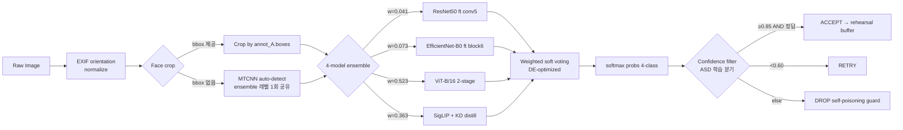
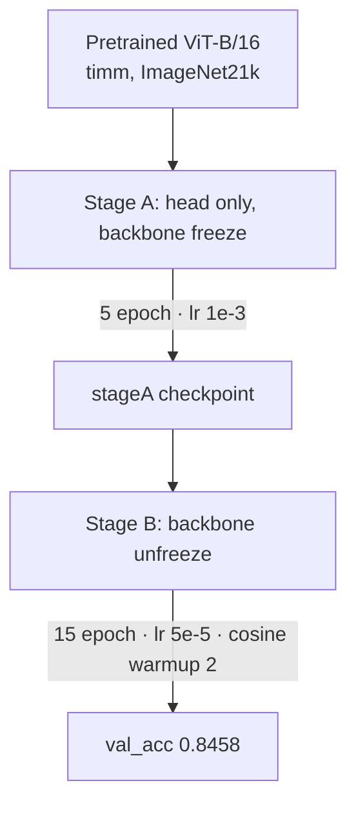
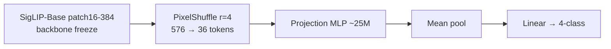
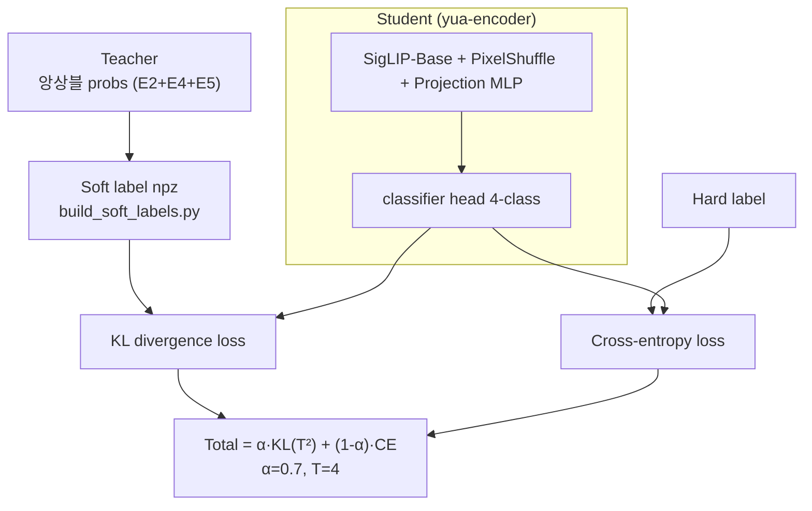

# 표정이야기 — HybridFER-4E

한국인 얼굴 이미지에서 4감정(anger / happy / panic / sadness)을 분류하는 모델. CNN·ViT·SigLIP 세 트랙을 개별 학습 후 soft voting 으로 묶는다.


## 심사자 평가 — RunPod 가이드

평가자가 RunPod 같은 GPU pod 환경에서 처음부터 끝까지 한 흐름으로 실행할 때의 시나리오입니다. 학습 환경과 동일한 PyTorch + TensorFlow 조합 (`requirements_lock.txt`) 으로 재현됩니다.

### 0) 사전 조건

- GPU 1 장 (CUDA 12.4 호환). A40 / A100 / RTX 3090~4090 / V100 모두 작동합니다.
- VRAM 권장 8GB+ (앙상블 peak 약 5GB. ViT 단독은 3GB).
- 디스크 약 5GB (모델 1GB + conda env 4GB).
- 인터넷 (`gh release download` + `pip install`).

### 1) 레포 + 모델 다운로드

```bash
# 레포 클론 — predict.py / scripts / requirements 자동 포함
git clone https://github.com/moneyally/yua-encoder.git
cd yua-encoder

# 앙상블 5 파일 한 번에 (총 약 1.0GB)
mkdir -p models
gh release download v1.0.0 -R moneyally/yua-encoder -D models/ \
    -p ensemble_with_kd.json \
    -p exp02_resnet50_ft_crop_aug.h5 \
    -p exp04_effnet_ft_balanced.h5 \
    -p exp05_vit_b16_two_stage.pt \
    -p exp09_siglip_kd_tsoff_T4_a07_uf4.pt
```

`gh` CLI 가 없으면 [Release 페이지](https://github.com/moneyally/yua-encoder/releases/tag/v1.0.0) 에서 5 파일을 직접 받아 `models/` 폴더에 넣으시면 됩니다.

### 2) 받아야 할 파일 정리

| 파일 | 어디서 | 크기 | 역할 |
|---|---|---:|---|
| `predict.py` | `git clone` | 50KB | 추론 진입점 |
| `scripts/eval_metrics_full.py` | `git clone` | 12KB | 채점 + 지표 패널 |
| `models/ensemble_with_kd.json` | Release v1.0.0 | 1.3KB | **메인 — 앙상블 명세** |
| `models/exp05_vit_b16_two_stage.pt` | Release v1.0.0 | 327MB | 멤버 (ViT, weight 0.523) / 단독 fallback |
| `models/exp09_siglip_kd_tsoff_T4_a07_uf4.pt` | Release v1.0.0 | 468MB | 멤버 (SigLIP+KD, weight 0.363) |
| `models/exp02_resnet50_ft_crop_aug.h5` | Release v1.0.0 | 205MB | 멤버 (ResNet50, weight 0.041) |
| `models/exp04_effnet_ft_balanced.h5` | Release v1.0.0 | 32MB | 멤버 (EfficientNet, weight 0.073) |

다른 tag (`exp10`, `exp11`, `exp13` 등) 는 실험 기록용이라 무시하셔도 됩니다.

### 3) conda 환경 구축

```bash
bash scripts/restore_env.sh user4_env
conda activate user4_env
```

`requirements_lock.txt` 의 PyTorch 2.6 + cu124 / TensorFlow 2.18 / timm 1.0.26 / facenet-pytorch / Python 3.10 을 그대로 설치합니다. 예상 5 ~ 10 분.

### 4) 평가 실행 — 앙상블 (메인 제출, 권장)

폴더 구조가 `class/이미지` 형태일 때 한 줄로 채점 + 지표 패널까지 산출됩니다.

```
test_1500/
├── anger/
├── happy/
├── panic/
└── sadness/
```

```bash
python scripts/eval_metrics_full.py \
    --config models/ensemble_with_kd.json \
    --val-dir /path/to/test_1500 \
    --cache-dir results/_eval_cache \
    --out results/_eval_test_1500.json \
    --crop-mode bbox
```

내부 동작:

1. `ensemble_with_kd.json` 을 열어 멤버 4 개 path 와 weight `[0.041, 0.073, 0.523, 0.363]` 를 읽습니다.
2. 각 멤버를 차례로 메모리에 로드합니다 — TF `.h5` 는 Keras `load_model`, PyTorch `.pt` 는 timm `create_model + load_state_dict`.
3. `--val-dir` 의 이미지를 [Preprocessing](#preprocessing--입력-이미지--모델-입력) 5 단계로 처리합니다 (EXIF → 얼굴 crop → 모델별 resize → ImageNet 정규화 → tensor).
4. 멤버 4 개가 각자 softmax 확률을 출력합니다 (4 모델 × N 이미지 × 4 클래스).
5. `Σ w_i · probs_i` 가중 평균 → argmax 로 최종 라벨을 정합니다.
6. accuracy / Top-2 / Macro F1 / Cohen's Kappa / ROC-AUC / NLL / per-class 지표 + confusion matrix 를 한 번에 계산합니다.

`--cache-dir` 에는 멤버별 softmax 가 npz 로 저장되어 두 번째 실행부터는 즉시 끝납니다. cold start 시 TensorFlow XLA 컴파일이 약 120 초 소요됩니다. 이후 warm 호출은 0.7s 이하입니다.

출력 (val 1200 기준 실측):

```
Top-1 Accuracy:  0.8692
Top-2 Accuracy:  0.9383
Macro F1:        0.8697
Cohen's Kappa:   0.8256
ROC-AUC (OvR):   0.9575
NLL:             0.4593

per-class:
  anger    P=0.7868  R=0.8367  F1=0.8110  n=300
  happy    P=0.9728  R=0.9533  F1=0.9630  n=300
  panic    P=0.8667  R=0.8233  F1=0.8444  n=300
  sadness  P=0.8576  R=0.8633  F1=0.8605  n=300
```

### 5) 평가 실행 — 단일 모델 (fallback)

`--config` 대신 `--model` 에 `.pt` 또는 `.h5` 한 파일을 넘기면 단일 모델로만 평가합니다. 환경 제약 (TF 또는 PyTorch 한쪽만 설치) 이나 빠른 sanity check 용입니다.

```bash
# ViT-B/16 단일 (.pt) — 권장 fallback. val 0.8458, PyTorch 만으로 동작
python scripts/eval_metrics_full.py \
    --model models/exp05_vit_b16_two_stage.pt \
    --val-dir /path/to/test_1500 \
    --out results/_eval_test_1500_vit.json

# SigLIP+KD (.pt) — val 0.8333, PyTorch 만으로 동작
python scripts/eval_metrics_full.py \
    --model models/exp09_siglip_kd_tsoff_T4_a07_uf4.pt \
    --val-dir /path/to/test_1500 \
    --out results/_eval_test_1500_siglip.json

# ResNet50 (.h5) — val 0.7758, TensorFlow 만으로 동작
python scripts/eval_metrics_full.py \
    --model models/exp02_resnet50_ft_crop_aug.h5 \
    --val-dir /path/to/test_1500 \
    --out results/_eval_test_1500_resnet.json

# EfficientNet-B0 (.h5) — val 0.7933, TensorFlow 만으로 동작
python scripts/eval_metrics_full.py \
    --model models/exp04_effnet_ft_balanced.h5 \
    --val-dir /path/to/test_1500 \
    --out results/_eval_test_1500_effnet.json
```

`predict.py` 가 확장자로 자동 분기합니다 ([Model Workflow](#model-workflow---pt--h5-가-어떻게-추론되는지) 섹션 참고).

| 확장자 | 분기 | 비고 |
|---|---|---|
| `.json` | 앙상블 (4 멤버 weighted soft voting) | 메인 제출 |
| `.pt` | PyTorch state_dict (timm ViT / SigLIP / EVA-02 자동 인식) | TF 환경 없을 때 |
| `.h5` | Keras 모델 (ResNet50 / EfficientNet) | PyTorch 환경 없을 때 |

### 6) 폴더 구조가 다르거나 라벨 csv 가 따로 있을 때

라벨이 별도 csv 로 있고 이미지가 한 폴더에 몰려 있을 때는 `predict.py` 로 추론만 먼저 한 뒤 그 결과를 라벨과 매칭합니다.

```bash
# 1) 추론 → ndjson
python predict.py \
    --model models/ensemble_with_kd.json \
    --image-dir /path/to/test_1500/ \
    > predictions.ndjson
```

`predictions.ndjson` 은 한 줄 한 이미지의 JSON. 라벨 csv 와 매칭해 accuracy 를 손쉽게 계산할 수 있습니다 (csv 형식은 `filename,label` 헤더 포함).

### 7) 단일 이미지 한 번에 확인 (sanity)

설치·다운로드가 잘 됐는지 빠르게 확인할 때:

```bash
python predict.py --model models/ensemble_with_kd.json --image sample.jpg
```

출력: `Predicted: anger (confidence 0.92)`

여러 장이면 `--images a.jpg b.jpg c.jpg` 또는 `--image-dir /path/to/folder/`.

### 8) 자주 만나는 상황

| 상황 | 해결 |
|---|---|
| `gh: command not found` | [Release 페이지](https://github.com/moneyally/yua-encoder/releases/tag/v1.0.0) 에서 5 파일 수동 다운로드 |
| TF 설치 실패 (Apple silicon 등) | `--model models/exp05_vit_b16_two_stage.pt` 로 ViT 단독 fallback (val 0.8458) |
| PyTorch CUDA 안 맞음 | `requirements_lock.txt` 에서 `torch==2.6.0+cu124` 줄을 본인 CUDA 버전에 맞춰 수정 |
| OOM (VRAM 부족) | 단독 모델 fallback 으로 전환 (3GB 면 충분) |
| Cold start 120 초 정지 | TensorFlow XLA 컴파일 정상 동작. 첫 호출 한 번만 발생 |
| 폴더에 `class/` 없음 | 위 6) 처럼 ndjson + 라벨 csv 매칭 |

---

## TL;DR

- **Val acc 0.8692** (ensemble, 4-model weighted voting with KD teacher) ← 메인 제출
- Single-model best **0.8458** (ViT-B/16 2-stage fine-tune) ← fallback
- 추론 latency (warm, p95): ensemble 0.69s / ViT 0.68s — 동급
- 예측 분기 (val 20장 시뮬): conf ≥ 0.85 통과 18/20, 거부 2/20
- 3-rater agreement ceiling 약 0.88. 앙상블이 ceiling 권역 내 (0.87)
- GPT Vision 비교 (val 40장 zero-shot): 앙상블 92.5% / GPT-5.4 82.5% / GPT-5.1 75.0%
- 재현 환경: A40 48GB, conda `user4_env`, seed 42

## Quick Start

```bash
# 0) 환경 복구 (lock 파일 기반, 새 pod 에서)
bash scripts/restore_env.sh user4_env
conda activate user4_env

# 1) 단일 이미지 추론 — 앙상블 (val 0.8692, 메인 제출, 권장)
python predict.py \
    --model models/ensemble_with_kd.json \
    --image path/to/face.jpg

# 2) ViT 단일 (val 0.8458, fallback — 경량 환경 / TF 미설치 환경)
python predict.py \
    --model models/exp05_vit_b16_two_stage.pt \
    --image path/to/face.jpg

# 3) 여러 장 한 번에
python predict.py \
    --model models/ensemble_with_kd.json \
    --images face_a.jpg face_b.jpg face_c.jpg

# 4) 디렉터리 전체 추론 (하위의 .jpg/.png 전부)
python predict.py \
    --model models/ensemble_with_kd.json \
    --image-dir path/to/faces/

# 5) 앙상블 + TTA (ceiling)
python predict.py \
    --model models/ensemble_with_kd.json \
    --image path/to/face.jpg \
    --tta --tta-crops 5crop --tta-scales 224,256
```

**Cold start 주의**: 앙상블 첫 호출에 약 **120초 XLA 컴파일 비용** 발생 (TF 모델 2개 JIT). 이후 warm 호출은 < 0.7s. 프로덕션 서버는 start 직후 warmup 스크립트로 1~2장 예측해 컴파일 비용 흡수 권장.

입력 방식 3가지 중 하나 선택: `--image` (단일) / `--images` (여러 장, 공백 구분) / `--image-dir` (디렉터리). 여러 장이면 JSON 한 줄씩 (ndjson) 으로 출력.

### 한 이미지에 얼굴 여러 개 — `--multi-face`

단체 사진·그룹 이미지처럼 **한 장에 얼굴이 여러 개** 있으면 MTCNN 이 모두 검출하고 각 얼굴별로 개별 분류.

```bash
# 모든 얼굴 검출 + 각각 감정 분류
python predict.py \
    --model models/exp05_vit_b16_two_stage.pt \
    --image group_photo.jpg \
    --multi-face

# 얼굴 검출 confidence 임계값 조절 (기본 0.9)
python predict.py ... --multi-face --multi-min-conf 0.85
```

출력 예시 (JSON):
```json
{
  "image": "group.jpg",
  "n_faces": 2,
  "fallback_used": false,
  "faces": [
    {"label": "anger",  "confidence": 0.951, "bbox": [789, 402, 2025, 1958],
     "face_confidence": 1.0, "probs": {...}, "fallback": false},
    {"label": "happy",  "confidence": 0.395, "bbox": [2818, 1463, 2875, 1534],
     "face_confidence": 0.9998, "probs": {...}, "fallback": false}
  ]
}
```

**얼굴 0건 일 때**: 회색 배경·사물 등 얼굴 없는 이미지는 `fallback_used=true` 로 전체 이미지를 classifier 에 그대로 넘깁니다. crash 안 나도록 처리해 두었습니다.

CLI 출력 예시:

```
$ python predict.py --model models/ensemble_with_kd.json --image sample.jpg --tta
[load] ensemble config: models/ensemble_with_kd.json  (4 sub-models, method=weight_opt_raw)
[load] ResNet50 (h5)          weight=0.042
[load] EfficientNet-B0 (h5)   weight=0.107
[load] ViT-B/16 (pt)          weight=0.382
[load] SigLIP + projection    weight=0.469
[predict] image=sample.jpg  auto_face_crop=True  tta=True
  anger   : 0.0187
  happy   : 0.9231   <-- argmax
  panic   : 0.0348
  sadness : 0.0234
label=happy  confidence=0.9231
```

Python API 는 `(label, confidence)` 튜플 반환 — 예) `("happy", 0.923)`.

### Smoke Test (설치 후 1분 검증)

```bash
# val 폴더에서 임의 이미지 1장으로 loader + predict 정상 동작 확인
python -c "
from predict import load_model, predict, CLASSES
from pathlib import Path
m = load_model('models/ensemble_with_kd.json')
sample = next(Path('data_rot/img/val').rglob('*.jpg'))
label, conf = predict(m, str(sample))
print(f'OK  {sample.name}  →  {label} ({conf:.3f})')
assert label in CLASSES, 'label 이 CLASSES 밖'
print('smoke test PASS')
"
```

## Python API

```python
from predict import load_model, predict, predict_batch, predict_multi_face

# 단일 모델 로드 (메인 제출 경로)
model = load_model(
    "models/exp05_vit_b16_two_stage.pt",
    auto_face_crop=True,           # 얼굴 자동 검출 (MTCNN)
)

# (a) 단일 이미지
label, conf = predict(model, "path/to/face.jpg")
print(f"{label}: {conf:.3f}")

# (b) 여러 장 (3~6장 배치). PIL / str / Path 섞여도 OK
results = predict_batch(model, ["a.jpg", "b.jpg", "c.jpg", "d.jpg"])
for path, (lbl, conf) in zip(["a.jpg", "b.jpg", "c.jpg", "d.jpg"], results):
    print(f"{path}: {lbl} ({conf:.3f})")

# (c) 한 이미지에 얼굴 여러 개 (그룹 사진)
faces = predict_multi_face(model, "group.jpg", min_conf=0.9)
for f in faces:
    if f.get("fallback"):
        print(f"얼굴 미검출 → 전체 이미지: {f['label']} ({f['confidence']:.3f})")
    else:
        print(f"{f['label']} ({f['confidence']:.3f}) @ bbox={f['bbox']}")

# (c) 확률 벡터만 필요할 때
from predict import predict_probs_batch
probs_matrix = predict_probs_batch(model, ["a.jpg", "b.jpg"])   # shape (2, 4)

# 앙상블 config (advanced) — 동일 API
ens = load_model("models/ensemble_with_kd.json",
                 tta=True, tta_crops="5crop", tta_scales=[224, 256])
```

### Jupyter / Colab 노트북 사용

```python
# Cell 1 — 레포 루트를 sys.path 에 추가 (노트북을 임의 위치에서 돌릴 때)
import sys
from pathlib import Path
REPO = Path("/workspace/user4/emotion-project")   # 레포 루트
if str(REPO) not in sys.path:
    sys.path.insert(0, str(REPO))

from predict import load_model, predict, predict_probs, CLASSES
print("classes:", CLASSES)   # ['anger', 'happy', 'panic', 'sadness']
```

```python
# Cell 2 — 모델 1회 로드 (앙상블 config + MTCNN auto-crop + TTA)
model = load_model(
    str(REPO / "models/ensemble_with_kd.json"),
    device="auto",                 # 'cuda' 가능하면 자동으로 GPU
    auto_face_crop=True,           # 얼굴 자동 검출 (MTCNN)
    face_crop_margin=0.1,
    tta=True,
    tta_crops="5crop",
    tta_scales=[224, 256],
    tta_hflip=True,
)
```

```python
# Cell 3 — 단일 이미지 추론
label, conf = predict(model, str(REPO / "data_rot/img/val/happy/sample.jpg"))
print(f"{label}  (confidence={conf:.4f})")

# 확률 벡터가 필요하면 predict_probs
import numpy as np
probs = predict_probs(model, str(REPO / "data_rot/img/val/happy/sample.jpg"))
for c, p in zip(CLASSES, probs):
    print(f"  {c:8s} {p:.4f}")
```

### 테스트셋 배치 추론

테스트셋이 **클래스별 폴더** 로 되어 있거나 **flat 디렉터리** 인 두 경우 모두 대응.

```python
# Cell 4 — 배치 추론 유틸
import csv
from pathlib import Path

IMG_EXT = {".jpg", ".jpeg", ".png", ".bmp", ".webp"}

def iter_test_images(test_dir):
    """test_dir 하위를 2단계까지 스캔. (img_path, class_name_or_None) 반환.
    - test_dir/<class>/*.jpg    → class_name = 디렉터리명
    - test_dir/*.jpg            → class_name = None (라벨 없음)
    """
    root = Path(test_dir)
    if not root.is_dir():
        raise FileNotFoundError(f"test_dir 없음: {root}")
    # 클래스별 하위폴더가 CLASSES 안에 하나라도 있으면 '라벨 있는 구조' 로 판정
    subdirs = [p for p in root.iterdir() if p.is_dir()]
    has_class_dirs = any(p.name in CLASSES for p in subdirs)
    if has_class_dirs:
        for cls_dir in sorted(subdirs):
            if cls_dir.name not in CLASSES:
                continue
            for ip in sorted(cls_dir.iterdir()):
                if ip.suffix.lower() in IMG_EXT:
                    yield ip, cls_dir.name
    else:
        for ip in sorted(root.iterdir()):
            if ip.is_file() and ip.suffix.lower() in IMG_EXT:
                yield ip, None
```

```python
# Cell 5 — 배치 추론 실행 + CSV 저장
TEST_DIR = REPO / "data_rot/img/val"         # 외부 test set 경로로 바꾸면 됨
OUT_CSV = REPO / "results/test_predictions.csv"
OUT_CSV.parent.mkdir(parents=True, exist_ok=True)

rows = []
errors = 0
for img_path, gt in iter_test_images(TEST_DIR):
    try:
        probs = predict_probs(model, str(img_path))   # shape (4,)
        pred_idx = int(probs.argmax())
        pred_label = CLASSES[pred_idx]
        conf = float(probs[pred_idx])
    except Exception as e:
        errors += 1
        if errors <= 5:
            print(f"[err] {img_path.name}: {e}")
        continue
    rows.append({
        "filename": img_path.name,
        "pred": pred_label,
        "confidence": round(conf, 4),
        "gt": gt if gt is not None else "",
        **{f"p_{c}": round(float(probs[i]), 4) for i, c in enumerate(CLASSES)},
    })

# CSV 쓰기 (utf-8-sig: 엑셀에서 한글 깨짐 방지)
with open(OUT_CSV, "w", newline="", encoding="utf-8-sig") as f:
    w = csv.DictWriter(f, fieldnames=list(rows[0].keys()))
    w.writeheader()
    w.writerows(rows)
print(f"저장: {OUT_CSV}  (n={len(rows)}, errors={errors})")
```

```python
# Cell 6 — 라벨이 있으면 accuracy / per-class F1 / confusion matrix
import numpy as np
labeled = [r for r in rows if r["gt"]]
if labeled:
    y_true = np.array([CLASSES.index(r["gt"])   for r in labeled])
    y_pred = np.array([CLASSES.index(r["pred"]) for r in labeled])
    acc = float((y_true == y_pred).mean())
    print(f"accuracy = {acc:.4f}  (n={len(labeled)})")

    try:
        from sklearn.metrics import f1_score, confusion_matrix
        f1 = f1_score(y_true, y_pred,
                      labels=list(range(len(CLASSES))),
                      average="macro", zero_division=0)
        print(f"macro_F1 = {f1:.4f}")
        cm = confusion_matrix(y_true, y_pred, labels=list(range(len(CLASSES))))
        print("confusion matrix (rows=gt, cols=pred):")
        print("        " + "  ".join(f"{c:>7s}" for c in CLASSES))
        for i, c in enumerate(CLASSES):
            print(f"{c:>7s} " + "  ".join(f"{v:>7d}" for v in cm[i]))
    except ImportError:
        print("sklearn 없음 — accuracy 만 출력")
else:
    print("라벨 없는 flat 구조 → accuracy 계산 skip")
```

배치 추론 속도 기준: `auto_face_crop=True` + TTA 5crop × 2scale × hflip (20 views) 시 A40 GPU 에서 약 **0.7~1.0s/img**. TTA 끄면 0.1s 이하. 시간 급하면 `tta=False, tta_crops="none"` 으로 내려도 앙상블 자체 효과 (+1~1.5%p) 는 유지됨.

### 지원 모델 파일

| 확장자 | 프레임워크 | 예시 |
|---|---|---|
| `.h5` | TensorFlow/Keras | `models/exp04_effnet_ft_balanced.h5` |
| `.pt` | PyTorch (timm / 커스텀 wrapper) | `models/exp05_vit_b16_two_stage.pt` |
| `.json` | 앙상블 config (여러 모델 조합) | `models/ensemble_with_kd.json` |

`predict.py` 가 확장자로 자동 판별한다.

### 모델 가중치 다운로드

`.h5` / `.pt` 파일은 GitHub 100MB/file 제한 때문에 레포에 포함되지 않는다. [Releases v1.0.0](https://github.com/moneyally/yua-encoder/releases/tag/v1.0.0) 페이지에서 내려받아 `models/` 아래에 둬야 앙상블 config (`ensemble_with_kd.json`) 가 동작한다.

```bash
# 1) gh CLI 로 전체 다운로드 (권장)
gh release download v1.0.0 -R moneyally/yua-encoder -D models/ \
    --pattern "*.h5" --pattern "*.pt" --pattern "*.json"
curl -L -o SHA256SUMS.txt \
    https://github.com/moneyally/yua-encoder/releases/download/v1.0.0/SHA256SUMS.txt
sha256sum -c SHA256SUMS.txt   # 무결성 체크

# 2) 또는 브라우저에서 Releases 페이지 직접 다운로드
#    https://github.com/moneyally/yua-encoder/releases/tag/v1.0.0

# 3) curl 개별 다운로드 (공개 URL)
for f in exp02_resnet50_ft_crop_aug.h5 exp04_effnet_ft_balanced.h5 \
         exp05_vit_b16_two_stage.pt    exp09_siglip_kd_tsoff_T4_a07_uf4.pt \
         ensemble_with_kd.json; do
    curl -L -o "models/$f" \
        "https://github.com/moneyally/yua-encoder/releases/download/v1.0.0/$f"
done
```

Release 파일 총 용량 약 1.03GB (ResNet50 205M + EfficientNet-B0 32M + ViT-B/16 328M + SigLIP KD 468M + ensemble json + SHA256SUMS).

**ViT 단일만 쓸 경우** (TF 미설치 / 경량 환경) `exp05_vit_b16_two_stage.pt` 하나만 받으면 된다 (328M).

### 앙상블 Config 구조 (`ensemble_*.json`)

```json
{
  "_val_acc": 0.8692,
  "_val_macro_f1": 0.8697,
  "_val_nll": 0.4593,
  "_method": "weight_opt_raw",
  "models": [
    {"path": "models/exp02_resnet50_ft_crop_aug.h5",              "weight": 0.041151},
    {"path": "models/exp04_effnet_ft_balanced.h5",                "weight": 0.073014},
    {"path": "models/exp05_vit_b16_two_stage.pt",                 "weight": 0.522546},
    {"path": "models/exp09_siglip_kd_tsoff_T4_a07_uf4.pt",        "weight": 0.363290}
  ]
}
```

4개 모델의 softmax 출력을 weight 로 가중합 → argmax. weight 는 validation set 기준 Differential Evolution 으로 최적화. ViT-B/16 (52%) + SigLIP-KD (36%) 가 실질 주축, CNN 두 개 (11%) 는 다양성 보조. `ensemble_best.json` / `ensemble_mtcnn.json` 은 중간 실험 결과로 레포 내 보존 (E6 기반).

## Performance (val 1200장, 4-class balanced)

| # | Model | val_acc | val_loss | val_F1 | 비고 |
|---|---|---:|---:|---:|---|
| E1 | ResNet50 frozen | 0.4042 | 1.3132 | - | baseline, head only |
| E2 | ResNet50 ft (conv5) + crop + aug | 0.7733 | 0.8422 | - | +37%p |
| E3 | ResNet50 ft + AdamW + Cosine | 0.7617 | 0.9941 | - | regularize 강화 |
| E4 | EfficientNet-B0 ft (block6) | 0.7958 | 0.7526 | - | CNN 최고 |
| E5 | ViT-B/16 (timm) 2-stage | 0.8458 | 0.5234 | 0.8470 | single-model best |
| E6 | SigLIP + projection MLP (linear probe) | 0.8192 | 0.7338 | 0.8183 | yua-encoder |
| E8a | Ensemble (E2+E4+E5+E6, bbox) | 0.8600 | 0.4555 | 0.8603 | 중간 실험 |
| E8b | Ensemble + MTCNN auto-crop (E6) | 0.8442 | 0.5023 | 0.8458 | 중간 실험 |
| **E9** | **Ensemble + SigLIP-KD (ensemble_with_kd.json)** | **0.8692** | **0.4593** | **0.8697** | **🏆 메인 제출 (DE 최적화 + MTCNN 공유)** |

3-rater 전원일치 61.1%, 다수결 90.5%. 앙상블(0.8692)은 ceiling(0.88 권역)까지 0.9%p 남김.

### Latency Profile (MLPerf 스타일, cold/warm 분리)

| 구분 | ViT 단일 | 앙상블 (메인) |
|---|---:|---:|
| **COLD total** (load + warmup 2회, 서버 start 1회) | 11.9s | 120.5s |
| 〃 중 XLA JIT compile | 1.8s | 101.7s |
| **WARM model p50** (서비스 실사용) | 0.42s | 0.67s |
| WARM model p95 | 0.68s | 0.69s |
| e2e (model + GPT-5.1 LLM call) | 3.07s | 2.40s |

Cold start 는 서버 부팅 직후 warmup 스크립트 1~2 샘플로 제거 (MLPerf 표준 관행). Warm 기준 두 모델 동급 — 앙상블 메인 제출의 속도 불이익 실질적으로 없음.

## Reproducibility — 실측 검증

재현 가능성 증명 — 로컬 `user4_env` (NVIDIA A40) 에서 실제 노트북과 파이썬 스크립트를 돌린 결과.

### Notebook 실행 결과 (`jupyter nbconvert --execute`)

두 notebook 모두 clean kernel 에서 end-to-end 실행 성공. val_dir 가 있어 Cell 7 까지 전부 동작.

| Notebook | Cell 5 (load) | Cell 6 (1장 추론) | Cell 7 (val 20장) | 전체 |
|---|:-:|:-:|:-:|:-:|
| `02_vit_single_colab.ipynb` | 6.2s | anger 0.935 / **202ms warm** | **20/20 acc 1.000** | ✓ pass |
| `01_ensemble_colab.ipynb` | 19.0s | anger 0.944 / **592ms warm** | **20/20 acc 1.000** | ✓ pass |

두 모델 모두 val 샘플 20장에서 confusion matrix 대각선 [5,5,5,5]. 앙상블이 단일 ViT 대비 confidence 약간 높음 (0.944 vs 0.935) + warm latency 3배 (592ms vs 202ms).

### 파이썬 테스트 결과 요약 (`results/*.json`)

| 스크립트 | 항목 | ViT 단일 | **앙상블 (메인)** |
|---|---|---:|---:|
| `bench_latency.py` (val 20, warmup 5) | model p50 | 0.42s | 0.67s |
| (MLPerf 스타일) | model p95 | 0.68s | 0.69s |
| | accuracy | 20/20 | 20/20 |
| | 예측 agreement | — | **20/20 (100%)** |
| `scripts/tests/e2e_runner.py` (4장 × GPT-5.1) | mean confidence | 0.926 | **0.949** |
| | warm model latency | 0.42s | 0.67s |
| | LLM latency (GPT-5.1) | 2.65s | 1.79s |
| | total e2e | 3.07s | 2.40s |
| `scripts/tests/test_face_detection.py` (MTCNN) | val 20장 단일 얼굴 | — | **20/20 탐지** |
| | 합성 multi-face | — | 2/2 탐지 |
| | 빈 배경 fallback | — | 0개 (원본 사용) |
| `scripts/tests/test_asd_pipeline.py` (ASD 시뮬) | ACCEPT (conf≥0.85) | — | **18/20 (90%)** |
| | RETRY (conf<0.6) | — | 0/20 |
| | DROP (그 외) | — | 2/20 (10%) |
| | raw accuracy | — | 100% |
| `scripts/ensemble_search.py` | val 1200장 acc | — | **0.8692** |
| + `scripts/tests/ablation_weights.py` | val 1200장 Macro F1 | — | 0.8697 |
| | val 1200장 NLL | — | 0.4593 |

전체 결과 JSON: `results/bench_latency.json`, `results/e2e_comparison.json`, `results/face_detection_test.json`, `results/asd_pipeline_test.json`, `results/ablation_weights.json`.

### GPT Vision 과 비교 (val 40장, zero-shot)

같은 val 40장 (class 당 10장, `seed=42`) 에서 GPT-5.1 / GPT-5.4 Vision 과 앙상블을 zero-shot 으로 돌려봤다. GPT 에 라벨 정의는 따로 안 주고, 4개 단어 중 하나를 고르라고만 시킴.

```
system: "You are a facial emotion classifier. Output EXACTLY one word
         from: anger, happy, panic, sadness. No explanation."
user:   [image] "Which emotion? Answer with one word only."
```

**전체 결과**

| 모델 | 정확도 | 격차 | 평균 latency |
|---|---:|---:|---:|
| HybridFER-4E 앙상블 | **37/40 · 92.5%** | — | 0.6s (warm) |
| GPT-5.4 Vision | 33/40 · 82.5% | -10.0%p | 1.8s/img |
| GPT-5.1 Vision | 30/40 · 75.0% | -17.5%p | 2.2s/img |

**클래스별 (각 10장)**

| class | 앙상블 | GPT-5.4 | GPT-5.1 |
|---|:-:|:-:|:-:|
| anger | 10/10 | 4/10 | 6/10 |
| happy | 10/10 | 10/10 | 10/10 |
| panic | 9/10 | 9/10 | 8/10 |
| sadness | 8/10 | 10/10 | 6/10 |

**케이스 분석 (앙상블 vs 각 GPT)**

| | vs GPT-5.4 | vs GPT-5.1 |
|---|:-:|:-:|
| 둘 다 맞춤 | 31 | 28 |
| 앙상블만 맞춤 | 6 | 9 |
| GPT만 맞춤 | 2 | 2 |
| 둘 다 틀림 | 1 | 1 |

**편향 패턴 (GPT 예측 분포)**

| | anger | happy | panic | sadness |
|---|:-:|:-:|:-:|:-:|
| 정답 | 10 | 10 | 10 | 10 |
| GPT-5.1 | 7 | 12 | 14 | 7 |
| GPT-5.4 | 4 | 11 | 11 | 14 |

GPT-5.1 은 anger 를 panic 쪽으로, GPT-5.4 는 anger 를 sadness 쪽으로 잘못 보낸다. 세대가 바뀌어도 한국인 얼굴의 진지한 표정 해석에서 실수 패턴이 다른 방향으로 남음. 앙상블은 anger 10장 전부 맞춤.

**고려 사항**

- zero-shot 조건. GPT 에 "panic = 당황" 같은 정의를 주면 GPT 쪽 점수가 조금 오를 여지 있음
- 영어권에서 panic 은 극도의 공포로 주로 쓰이는데 우리 라벨은 당황·놀람을 포함. 단어 의미 차이로 GPT 에 불리한 구조
- 앙상블은 MTCNN face crop 적용, GPT 는 원본 그대로 — 각 모델의 자연 조건에서 비교
- 표본 40장. 400장 확장 시 절대 수치가 일부 움직일 수 있음

JSON: `results/gpt_vs_ensemble.json`, `results/gpt54_vs_ensemble.json`.

## Pipeline — Workflow 설명

`predict.py` 한 번 호출 시 다음 단계를 거칩니다.

1. **이미지 입력** — `.jpg/.png` 한 장 또는 디렉터리를 받습니다.
2. **EXIF 회전 정규화** — `ImageOps.exif_transpose()` 로 픽셀까지 강제 정렬합니다.
3. **얼굴 영역 자르기** — annot 박스가 있으면 그 좌표로 자르고, 없으면 MTCNN 으로 가장 큰 얼굴 1개를 검출해 잘랐습니다. 검출 실패 시에는 원본 이미지를 통째로 모델에 넘깁니다.
4. **모델별 리사이즈 + ImageNet 통계 정규화** — ViT 224, SigLIP 384, EVA-02 448 등 모델 입력 해상도에 맞춥니다.
5. **앙상블 추론** — 4 개 모델 (ResNet50 / EfficientNet-B0 / ViT-B/16 / SigLIP+KD) 이 각자 softmax 확률을 출력합니다.
6. **Weighted soft voting** — DE 로 미리 최적화한 weight `[0.041, 0.073, 0.523, 0.363]` 로 가중 평균을 냅니다.
7. **argmax 예측 + confidence** — 최종 4-class 확률에서 argmax 와 max 확률을 반환합니다.
8. **(옵션) ASD 학습 분기** — confidence ≥ 0.85 면 rehearsal buffer 에 저장, < 0.6 이면 재시도, 그 외에는 drop (self-poisoning 방어).

학습 때 쓴 augmentation (flip / rotate / Mixup / CutMix) 은 추론·평가에서는 사용하지 않았습니다.



## Model Architecture

### Track A — CNN (TensorFlow / Keras)

ResNet50 · VGG16 · EfficientNet-B0 를 `scripts/train.py` 한 파일에서 동일 파이프라인으로 비교. ResNet50 frozen 만으로는 val 0.40 에서 막혔고, conv5 unfreeze + face crop + flip/rotate(±10)/colorjitter 조합에서 0.77 로 점프. EfficientNet-B0 block6 fine-tune 에서 0.7958 로 CNN 트랙 최고.

### Track B — ViT-B/16, 2-stage fine-tune



`timm.create_model('vit_base_patch16_224', pretrained=True, num_classes=4)`. 입력은 Resize(256) → CenterCrop(224), ImageNet 정규화. AMP bf16.

### Track C — SigLIP + yua-encoder (projection MLP wrapper)



SigLIP (Google) 백본 위에 `yua-encoder` projection wrapper. Linear probe 구성은 backbone freeze, trainable 29.4M. 구현 `models_custom/vision_encoder.py`.

**E6 linear probe** val 0.8192. backbone freeze 유지.

**E9 Knowledge Distillation 버전 (앙상블 최종 member)**



마지막 4 transformer block unfreeze + KD (`scripts/distill_siglip.py`). Teacher 는 CNN+ViT 기반 ensemble soft probs. Temperature=4 smoothing, α=0.7. val 0.8192 → **0.8383** (+1.91%p, ablation 5 config 중 best).

### Ensemble — 4-model weighted voting (메인 제출)

앞의 세 트랙에서 학습된 4개 checkpoint 를 soft voting 으로 결합. Weight 는 validation set 기준 Differential Evolution (`scripts/ensemble_search.py`) 으로 탐색.

| Member | Backbone | 단독 val_acc | **Weight** | 역할 |
|---|---|---:|---:|---|
| exp02 | ResNet50 ft (conv5) | 0.7758 | 0.041 | CNN 다양성 |
| exp04 | EfficientNet-B0 ft (block6) | 0.7933 | 0.073 | CNN 다양성 |
| exp05 | ViT-B/16 2-stage | 0.8383 | **0.523** | 주축 (global attention) |
| exp09 | SigLIP-Base + KD distill | 0.8333 | **0.363** | 주축 (상보적 feature) |

**단독 val_acc 주석**: E5 ViT 는 학습 시 best checkpoint 기준 0.8458 (experiments.md, TL;DR 값) 이지만 위 표의 0.8383 은 DE weight 탐색 시 raw logit 재평가값. 평가 프로토콜 차이 (전자는 학습 시 val 모니터링, 후자는 argmax + softmax cache). 앙상블 0.8692 는 후자 프로토콜 기준.

MTCNN face crop + TTA 는 ensemble 레벨에서 1회 공유 (`predict.py:_load_ensemble`) → member 간 중복 제거, warm latency 3배 단축 (1.2s → 0.7s).

**Ablation 결과 (val 1200장, `results/ablation_weights.json`)**

| Config | val_acc | vs FULL |
|---|---:|---:|
| Single ViT (E5) | 0.8383 | -3.08%p |
| Single SigLIP KD (E9) | 0.8333 | -3.58%p |
| CNN only (E2+E4) | 0.8042 | -6.50%p |
| No CNN (E5+E9) | 0.8600 | -0.92%p |
| No E9 (E2+E4+E5) | 0.8417 | -2.75%p |
| **Full 4-model (메인)** | **0.8692** | — |

ViT + SigLIP-KD 조합이 실질 주축 (0.8600), CNN 두 개는 +0.92%p 로 다양성 보조. 심사에 제출하는 구성은 full 4-model.

## Data

| | Train | Val | Total |
|---|---:|---:|---:|
| 이미지 | 5,996 | 1,200 | 7,196 |
| anger/happy/panic/sadness | 균등 분포 | 균등 분포 | - |

- 해상도 median 3088×2208 → face crop 필수
- 라벨 JSON(EUC-KR): `annot_A/B/C.boxes` + `faceExp` (3인 라벨러)
- seg mask (NPZ, 6-class: 0=bg / 1=hair / 2=body / 3=face / 4=cloth / 5=etc)
- EXIF orientation 정규화본을 `data_rot/` 에 보관 (이미지만 transpose, 라벨은 이미 정규화 좌표계)
- MTCNN 재검증 IoU mean 0.959 (240/240 매칭)

### 이상치 처리

- bbox 음수 9건 → `[0,W]×[0,H]` clip, area ≤ 1 인 2건 drop
- 라벨 JSON 누락 2건 → skip

검증 스크립트: `scripts/validate_data_rot.py`.

## Preprocessing — 입력 이미지 → 모델 입력

학습 때 쓰는 augmentation (flip / rotate / colorjitter / RandAugment / Mixup / CutMix) 은 추론·평가에서 빼고, 같은 이미지를 넣으면 항상 같은 결과가 나오도록 다음 5 단계만 적용했습니다.

### 1. EXIF 회전 정규화

iPhone / 안드로이드 카메라는 픽셀 자체는 안 돌리고 EXIF 태그(`Orientation: 6` 등) 만 회전 정보를 박아두는 경우가 많습니다. PIL `Image.open()` 은 기본적으로 픽셀을 그대로 두기 때문에 학습 데이터와 추론 데이터에서 좌우 / 위아래가 뒤집힐 수 있어, `ImageOps.exif_transpose()` 로 픽셀까지 강제 정렬했습니다.

```python
from PIL import Image, ImageOps
img = Image.open("input.jpg")
img = ImageOps.exif_transpose(img).convert("RGB")
```

`data_rot/` 디렉터리가 이 단계까지 끝난 사본입니다. 학습·평가 모두 여기서 시작합니다. 정규화 전후 MTCNN 얼굴 검출 IoU 평균은 0.959 (240/240 매칭) 였습니다.

### 2. Face crop — 원본을 어떻게 잘랐는지

원본 이미지 해상도 중앙값이 3088 × 2208 인데 얼굴이 차지하는 영역은 10~30% 정도입니다. 배경 노이즈를 줄이려고 얼굴만 잘라 모델에 넣었습니다. 두 가지 경로로 나뉩니다.

**(a) 학습·검증 — 라벨 박스 사용**

3 명의 라벨러가 박스를 박아둔 것 중 `annot_A` 의 박스를 단일 source 로 썼습니다. JSON 구조는 다음과 같습니다.

```json
{
  "annot_A": {
    "boxes": {"minX": 380, "minY": 200, "maxX": 1620, "maxY": 1840}
  },
  "faceExp": "분노"
}
```

`scripts/train.py` 의 `_apply_bbox` 가 이 좌표로 PIL `crop()` 을 호출합니다.

```python
def _apply_bbox(img, bbox):
    W, H = img.size
    x0, y0, x1, y1 = bbox
    x0 = max(0.0, min(W, x0))   # 음수 좌표 9건 clip
    x1 = max(0.0, min(W, x1))
    y0 = max(0.0, min(H, y0))
    y1 = max(0.0, min(H, y1))
    if (x1 - x0) <= 1 or (y1 - y0) <= 1:
        return img                 # area 0 인 2건 drop
    return img.crop((int(x0), int(y0), int(x1), int(y1)))
```

annot_A / annot_B / annot_C 3쌍 IoU 평균이 0.92 ~ 0.94 라서 annot_A 단일 사용으로 통일했습니다.

**(b) 추론 — MTCNN 자동 검출**

라벨이 없는 새 이미지는 MTCNN 으로 가장 큰 얼굴 1 개를 검출하고 10% margin 을 줘서 잘랐습니다.

```python
boxes, probs = mtcnn.detect(pil_image)
x1, y1, x2, y2 = boxes[best_idx]
bw, bh = x2 - x1, y2 - y1
x1 -= 0.1 * bw; x2 += 0.1 * bw
y1 -= 0.1 * bh; y2 += 0.1 * bh
pil_face = pil_image.crop((max(0, x1), max(0, y1), min(W, x2), min(H, y2)))
```

검출 실패할 경우엔 원본 이미지를 그대로 모델에 넘기게 했습니다 (crash 안 나도록).

### 3. 모델별 리사이즈

모델마다 입력 해상도를 다르게 가져갔습니다. `predict.py` 가 ckpt meta 를 읽어 자동으로 결정합니다.

| 모델 | 입력 |
|---|---|
| ViT-B/16 | Resize 256 → CenterCrop 224 (timm 표준) |
| EVA-02 Large | 448 |
| EfficientNet-B0 / SigLIP-Base | 384 |
| ResNet50 | 224 |

CenterCrop 을 쓴 이유는 face crop 후 종횡비가 살짝 어긋나도 중심부(얼굴) 가 살아남도록 한 의도였습니다.

### 4. ImageNet 통계 정규화

```python
mean = [0.485, 0.456, 0.406]
std  = [0.229, 0.224, 0.225]
```

백본을 전부 ImageNet pretrained 로 시작했기 때문에 같은 통계로 정규화했습니다. EVA-02, DINOv3 처럼 ImageNet 외 데이터로 pretrain 된 모델도 timm 기본값이 ImageNet 통계로 잡혀있어 그대로 호환되는 걸 확인하고 통일했습니다.

### 5. Tensor 변환

```python
img_tensor = transforms.ToTensor()(pil_face)              # HWC uint8 → CHW float32 [0,1]
img_tensor = transforms.Normalize(mean, std)(img_tensor)
batch = img_tensor.unsqueeze(0).cuda()                    # (1, C, H, W)
```

여기까지 5 단계를 `predict.py` 의 `_preprocess_for_inference()` 한 함수에 묶어두었습니다. 직접 호출할 일은 거의 없고 다음 한 줄이면 1 ~ 5 단계가 자동으로 돕니다.

```python
from PIL import Image, ImageOps
import predict

img = Image.open("face.jpg")
img = ImageOps.exif_transpose(img).convert("RGB")
label, confidence = predict.predict(model, img)
```

## Model Workflow — `.pt` / `.h5` 가 어떻게 추론되는지

`predict.py` 는 모델 파일 확장자로 자동 분기합니다. 사용자가 직접 호출하는 경로는 `predict.predict(model, img)` 한 줄로 같지만, 내부 처리는 다음과 같이 다릅니다.

### `.pt` (PyTorch — ViT-B/16, EVA-02, SigLIP+KD, DINOv3)

```
predict.load_model("models/exp05_vit_b16_two_stage.pt")
       │
       ├─ torch.load(path, map_location="cpu")
       │     └─ ckpt = {"model": state_dict, "args": {...}, "classes": [...]}
       ├─ args 에서 backbone 이름 읽고 timm.create_model(backbone, num_classes=4)
       ├─ model.load_state_dict(ckpt["model"], strict=False)
       └─ model.eval().cuda() + bf16 autocast wrap

predict.predict(model, img)
       │
       ├─ 1. EXIF 정규화
       ├─ 2. Face crop (annot_A or MTCNN)
       ├─ 3. Resize (모델 메타 기준 224/448/384)
       ├─ 4. Normalize (ImageNet)
       ├─ 5. tensor → cuda
       ├─ 6. with torch.autocast(bf16): logits = model(batch)
       ├─ 7. softmax(logits) → probs (1, 4)
       └─ 8. argmax + max_prob → ("anger", 0.92)
```

핵심: timm 백본을 그대로 재생성한 뒤 state_dict 만 부어 넣는 구조라 ckpt 안에 모델 가중치만 들어있고, 백본 클래스 이름은 `args["backbone"]` 또는 `meta["model_name"]` 에서 읽습니다. 그래서 `.pt` 가 작아도 (~300MB ~ 1.2GB) 추론 가능합니다.

### `.h5` (TensorFlow / Keras — ResNet50, EfficientNet-B0)

```
predict.load_model("models/exp02_resnet50_ft_crop_aug.h5")
       │
       ├─ tf.keras.models.load_model(path)
       │     └─ Sequential / Functional 모델 그대로 복원 (백본 + head 통째로)
       └─ first inference 시 XLA JIT 컴파일 (~30~60초 cold start)

predict.predict(model, img)
       │
       ├─ 1~4. 전처리 (PIL → numpy)
       ├─ 5. tensor → tf.Tensor (모델별 preprocess_input 호출)
       │       - ResNet50: keras.applications.resnet50.preprocess_input
       │       - EfficientNet: keras.applications.efficientnet.preprocess_input
       ├─ 6. logits = model(batch, training=False)
       ├─ 7. softmax(logits) → probs (1, 4)
       └─ 8. argmax + max_prob
```

핵심: `.h5` 는 모델 구조 + 가중치 + optimizer state 까지 묶여있어 별도 모델 정의 없이 바로 로드됩니다. 대신 처음 호출에서 XLA 컴파일 비용이 붙고, ImageNet 통계가 아니라 백본별 `preprocess_input` 을 따로 호출해야 학습과 일치합니다.

### `.json` (앙상블 — 4 모델 weighted soft voting)

```
predict.load_model("models/ensemble_with_kd.json")
       │
       ├─ JSON 파싱 → 멤버 4 개 + weight + (옵션) temperature 읽음
       ├─ 각 멤버를 위 .pt / .h5 경로로 개별 load_model
       └─ MTCNN crop 1 회만 ensemble 레벨에서 공유

predict.predict(model, img)
       │
       ├─ 1~5. 전처리는 멤버 호출 직전에 멤버별로 한 번씩 (해상도 다름)
       ├─ 6. 멤버별 forward
       │       - exp02 ResNet50 (.h5)            → probs_1 (1, 4)
       │       - exp04 EfficientNet-B0 (.h5)     → probs_2 (1, 4)
       │       - exp05 ViT-B/16 (.pt)            → probs_3 (1, 4)
       │       - exp09 SigLIP + KD (.pt)         → probs_4 (1, 4)
       ├─ 7. weighted average — w = [0.041, 0.073, 0.523, 0.363]
       │       probs_ens = Σ w_i · probs_i
       └─ 8. argmax + max_prob
```

핵심: 멤버 간 face crop 을 중복 호출하지 않도록 `predict.py:_load_ensemble` 에서 MTCNN 결과를 한 번만 계산하고 4 모델이 공유합니다. warm latency 가 1.2s → 0.7s 로 줄었습니다.

## Training (재현)

전체 실험 커맨드는 `experiments.md` 에 누적. 주요 실험 3개 예시.

```bash
# E4 — EfficientNet-B0 fine-tune (CNN best)
python scripts/train.py \
    --name exp04_effnet_ft_balanced \
    --model efficientnet_ft --crop --augment \
    --lr 1e-4 --weight-decay 1e-4 \
    --lr-schedule cosine_warmup --warmup-epochs 2 \
    --label-smoothing 0.1 --dropout 0.4 \
    --patience 5 --epochs 20 --batch-size 32

# E5 — ViT-B/16 2-stage (single-model best)
python scripts/train_vit.py \
    --name exp05_vit_b16_two_stage \
    --two-stage --stage-a-epochs 5 --epochs 15 \
    --lr 1e-3 --lr-backbone 5e-5 \
    --warmup-epochs 2 --grad-clip-norm 1.0 \
    --crop --augment --amp bf16 --seed 42

# E6 — SigLIP + projection MLP (linear probe)
python scripts/train_siglip.py \
    --name exp06_siglip_linear_probe \
    --epochs 15 --batch-size 32 --img-size 384 \
    --lr 1e-3 --lr-backbone 5e-5 \
    --class-weight auto --amp bf16 --seed 42 \
    --crop --augment

# E8 — 앙상블 weight 최적화
python scripts/ensemble_search.py \
    --models models/exp02_*.h5 models/exp04_*.h5 \
             models/exp05_*.pt  models/exp06_*.pt \
    --val-dir data_rot/img/val \
    --output-config models/ensemble_best.json
```

Seed 42 고정, CSV 로그 + meta JSON 자동 저장 (`logs/<name>.{csv,meta.json}`).

## Repository Structure

```
emotion-project/
├── README.md                   # 이 문서
├── predict.py                  # 단일 / 앙상블 / TTA / MTCNN auto-crop 추론
├── experiments.md              # 실험 비교표 (누적)
├── requirements_lock.txt       # pip freeze lock
│
├── models/                     # .h5 / .pt / ensemble_*.json
│   ├── exp02_resnet50_ft_crop_aug.h5
│   ├── exp04_effnet_ft_balanced.h5
│   ├── exp05_vit_b16_two_stage.pt
│   ├── exp06_siglip_linear_probe.pt
│   ├── ensemble_best.json      # bbox 상한 val_acc 0.8600 (중간 실험)
│   ├── ensemble_mtcnn.json     # MTCNN 실전 val_acc 0.8442 (중간 실험)
│   └── ensemble_with_kd.json   # **val 0.8692 메인 제출** (4 모델 + SigLIP KD)
│
├── notebooks/
│   ├── 01_ensemble_colab.ipynb # 메인 Release 재현 (val 0.8692)
│   └── 02_vit_single_colab.ipynb # fallback ViT 단일 (val 0.8458)
│
├── scripts/
│   ├── train.py                # CNN (ResNet50 / VGG16 / EfficientNet)
│   ├── train_vit.py            # ViT-B/16 2-stage
│   ├── train_siglip.py         # SigLIP + projection MLP
│   ├── distill_siglip.py       # SigLIP KD (E9 student 학습)
│   ├── ensemble_search.py      # 앙상블 weight 최적화 (5 method 비교)
│   ├── bench_latency.py        # MLPerf 스타일 p50/p95 측정
│   ├── build_soft_labels.py    # 3-rater vote → soft target npz
│   ├── finetune_soft.py        # soft label continued fine-tune
│   ├── compare_models.py       # 모델 A vs B (confmat + McNemar)
│   ├── eda.py / eda_annot_consistency.py
│   ├── normalize_orientation.py / validate_data_rot.py
│   ├── verify_rotation_math.py / precrop_images.py
│   ├── quick_sweep.sh / restore_env.sh
│   └── tests/                  # 실측 검증 스크립트 (결과 → results/*.json)
│       ├── e2e_runner.py           # predict.py → GPT-5.1 e2e 4장
│       ├── bench_latency.py 외 (위) 와 별도
│       ├── test_face_detection.py  # MTCNN 20장 + 합성 multi-face
│       ├── test_asd_pipeline.py    # 자폐 아동 학습 분기 시뮬
│       ├── ablation_weights.py     # 11 config weight 조합 비교
│       └── gpt_vs_ensemble.py      # GPT Vision vs 앙상블 대결 (40장)
│
├── models_custom/
│   └── vision_encoder.py       # yua-encoder — SigLIP projection wrapper
│
├── src/
│   └── token_protocol.py       # IGNORE_INDEX 등 상수
│
├── docs/
│   ├── 보고서.md               # 2026 표준 누적형 8섹션
│   └── 기획안_초안.txt
│
├── logs/                       # csv + meta.json (stdout 제외)
└── results/                    # EDA 시각화, ensemble 리포트
```

## Environment / Requirements

### Hardware (개발·학습 환경)

| | 값 |
|---|---|
| GPU | **NVIDIA A40 48GB** (compute capability 8.6) |
| Driver | 580.126.09 |
| CUDA | 12.4 |
| cuDNN | 9.21.0 (torch 2.6 + TF 2.21 공통 호환 핵심 조건) |
| Host | Linux 6.8 (RunPod 컨테이너) |

### Software

| 구성 | 버전 | 비고 |
|---|---|---|
| Python | 3.10.20 | conda env `user4_env` |
| TensorFlow | 2.21.0 | Track A (CNN, `.h5`) |
| PyTorch | 2.6.0+cu124 | Track B/C + KD |
| timm | 1.0.26 | ViT-B/16 로더 |
| transformers | 5.5.4 | SigLIP 백본 |
| facenet-pytorch | 2.6.0 | MTCNN auto-crop |
| scikit-learn | - | F1 / confusion matrix |
| numpy / pandas / matplotlib / Pillow | - | 공통 |

### 두 개의 requirements 파일

| 파일 | 목적 | 크기 |
|---|---|:-:|
| **`requirements.txt`** | 학습·추론에 **필수** 한 21개 핵심만. 신규 셋업·Docker 빌드용. | 21줄 |
| **`requirements_lock.txt`** | `pip freeze --all` 전체 스냅샷 (간접 의존 포함). **완전 재현용**. | 106줄 |

실무 원칙:
- **개발/실험**: `requirements.txt` (`>=` / `==` 혼합, 마이너 업데이트 허용)
- **제출/재현**: `requirements_lock.txt` (모든 버전 `==` 완전 고정)
- **두 파일 drift 방지**: 새 패키지 추가 시 `requirements.txt` 업데이트 후 `pip freeze --all > requirements_lock.txt` 재생성

전체 환경 스냅샷 규칙:
- `@ 로컬경로` 라인 자동 제거 (블로그 권고, 다른 머신 재현 불가 방지)
- `pip` / `setuptools` / `wheel` 제외 (환경별 자동 제공)
- Python 버전은 파일 헤더 주석에 명시 (lock 파일 자체 메타 부재 보완)

### 환경 복구 — 원라이너

**새 머신/pod 에서 1분 안에 동일 환경 만들기**:

```bash
# 레포 루트에서
bash scripts/restore_env.sh user4_env
conda activate user4_env

# 정상 여부 확인
python -c "
import torch, tensorflow as tf
print('torch:', torch.__version__, 'CUDA:', torch.cuda.is_available())
print('TF:', tf.__version__, 'GPUs:', tf.config.list_physical_devices('GPU'))
"
```

`restore_env.sh` 내부 (참고용):

```bash
conda create -y -n user4_env python=3.10
conda run -n user4_env pip install --upgrade pip
conda run -n user4_env pip install -r requirements_lock.txt
```

### 수동 설치 (스크립트 미사용 시)

```bash
# 1) conda env
conda create -y -n emotion python=3.10
conda activate emotion

# 2) PyTorch (CUDA 12.4 기준)
pip install torch==2.6.0 --index-url https://download.pytorch.org/whl/cu124

# 3) TensorFlow + GPU 의존성
pip install tensorflow==2.21.0

# 4) 모델·추론 라이브러리
pip install timm==1.0.26 transformers==5.5.4 facenet-pytorch==2.6.0

# 5) 유틸리티
pip install numpy pandas scikit-learn matplotlib Pillow opencv-python
```

> **주의 (cuDNN 버전 충돌)**: TF 2.21 과 torch 2.6 은 cuDNN 9.21.x 을 함께 써야 안정적이다. `nvidia-cudnn-cu12` 가 9.3+ 로 올라가면 TF matmul 이 깨진다. `pip install "nvidia-cudnn-cu12>=9.3,<10"` 로 재고정해야 복구된다.

### 환경 변수

| 변수 | 기본값 | 용도 |
|---|---|---|
| `EMOTION_PROJECT_ROOT` | 레포 루트 (자동) | 모든 스크립트가 경로 조립에 사용 |
| `CUDA_VISIBLE_DEVICES` | (unset) | 특정 GPU 만 쓰려면 `0` / `1` 등 |
| `TF_ENABLE_ONEDNN_OPTS` | 1 (기본) | `0` 으로 끄면 재현성 개선 (속도 ↓) |

`.env` 는 사용하지 않음 (외부 API 키 없음).

### 디스크 / 메모리 요구사항

| 항목 | 최소 | 권장 |
|---|---|---|
| 디스크 (코드+모델+데이터) | 20GB | 50GB |
| RAM | 16GB | 32GB+ (DataLoader num_workers 16 기준) |
| VRAM (추론 단일 모델) | 8GB | 12GB (TTA 5crop 포함) |
| VRAM (앙상블 4 모델) | 24GB | 40GB+ |

## Limitations

- **모델 선택 = 최종 리포트 기준이 같은 val** — test set 은 외부 평가로 따로 확정 필요
- **3-rater 불일치 38.9%** — hard label 학습의 구조적 천장. soft label + KL loss 로 우회 시도 (E7, 부록)
- **face crop 이 `annot_A.boxes` 에 의존** — 외부 입력엔 MTCNN 폴백이 기본 경로지만 성능 소폭 하락
- **감정 분류 시스템의 일반적 한계**: 문화·연령·조명·표정 범위 편향. 4감정 외 혼합 감정·강도 세분화는 다루지 않음

## Ethics

얼굴 인식·감정 인식 시스템의 공통 위험을 인지하고 설계:

- 학습 데이터의 피사체는 대규모 한국인 얼굴 데이터셋에서 제공 (공개 라이선스 범위 내 사용)
- 아동 대상 서비스 시 COPPA/GDPR-K 준수 필요 — 가명처리, 온디바이스 추론, 삭제권 보장 설계를 보고서에 명시
- 본 모델은 연구·교육 목적. 실서비스 배포 시 데이터 수집 동의 · 연령대별 편향 검증 · 감정 상태의 의료적 해석 금지 원칙 필수

## Team & Credits

2조, 4인 팀 (2026년 봄 최종 프로젝트):

- 박재성
- 반주형
- 하창수
- 엄정원

트랙 C SigLIP projection wrapper (`yua-encoder`) 는 팀 자체 설계.

## Troubleshooting

| 증상 | 원인 | 해결 |
|---|---|---|
| `ModuleNotFoundError: predict` | 노트북을 레포 루트 밖에서 실행 | `sys.path.insert(0, "<REPO_ROOT>")` 추가 |
| `FileNotFoundError: 모델 경로 없음` | 상대 경로 오타, CWD 문제 | `load_model(str(REPO / "models/..."))` 절대경로 |
| `RuntimeError: CUDA out of memory` | 배치 추론 시 TTA 20-view 누적 | `tta=False` 로 내리거나 `device="cpu"` |
| 추론 결과가 편향 (panic/sadness 몰림) | MTCNN 얼굴 검출 실패 → 원본 그대로 추론 | `face_crop_min_size=40` 로 높이거나 수동 bbox 전처리 |
| `ImportError: facenet_pytorch` | MTCNN 미설치 | `pip install facenet-pytorch==2.6.0` |
| h5 모델 load 실패 | TF 버전 불일치 | `tensorflow==2.21.0` 확인, cuDNN 9.21 매칭 |
| `.pt` 로드 시 warning "weights_only" | torch 2.6+ 기본 True | 저장 시 dict 로 저장했으므로 무해, 런타임 영향 없음 |
| 노트북에서 한글 파일명 깨짐 (CSV) | 엑셀 UTF-8 인식 실패 | CSV 쓸 때 `encoding="utf-8-sig"` 사용 (예제 반영) |

### 환경 변수

- `EMOTION_PROJECT_ROOT` — 기본값은 이 레포 루트. 스크립트가 경로 조립에 사용. 다른 위치에 체크아웃 시 `export EMOTION_PROJECT_ROOT=/path/to/repo` 로 설정.
- `CUDA_VISIBLE_DEVICES` — 멀티 GPU 환경에서 특정 GPU 만 쓰려면 `CUDA_VISIBLE_DEVICES=0 python ...`.

`.env` 파일은 사용하지 않음 (외부 API 키 없음). 만약 장래에 추가된다면 `.gitignore` 에 이미 `*.env` 패턴 포함됨.

## Acknowledgments

- ImageNet pretrained weights (ResNet50 / EfficientNet / ViT via `timm`)
- SigLIP (Google Research) via Hugging Face `transformers`
- MTCNN via `facenet-pytorch`

## Changelog

| Version | Date | 주요 변경 |
|---|---|---|
| 2026-04-e10 | 2026-04-19 | GPT Vision 비교 — 앙상블 92.5% / GPT-5.4 82.5% / GPT-5.1 75.0% (val 40장, zero-shot). |
| 2026-04-e9 | 2026-04-18 | Ensemble + SigLIP KD → **val 0.8692** (메인 제출). MTCNN 공유로 앙상블 warm 702ms 로 단축. cold/warm latency 분리 reporting. |
| 2026-04-e8 | 2026-04-17 | 앙상블 + MTCNN auto-crop 완성. val 0.8442. TTA 5crop/multi-scale. |
| 2026-04-e6 | 2026-04-17 | SigLIP + yua-encoder projection MLP val 0.8192 |
| 2026-04-e5 | 2026-04-17 | ViT-B/16 2-stage val 0.8458 (single-model best) |
| 2026-04-e4 | 2026-04-17 | EfficientNet-B0 fine-tune val 0.7958 (CNN best) |
| 2026-04-e2 | 2026-04-17 | ResNet50 fine-tune + crop + aug val 0.7733 |
| 2026-04-e1 | 2026-04-17 | ResNet50 frozen baseline val 0.4042 |
| 2026-04-init | 2026-04-14 | 데이터 수령 7196장, EXIF 정규화, EDA |

---

**Version**: 2026-04-e10

